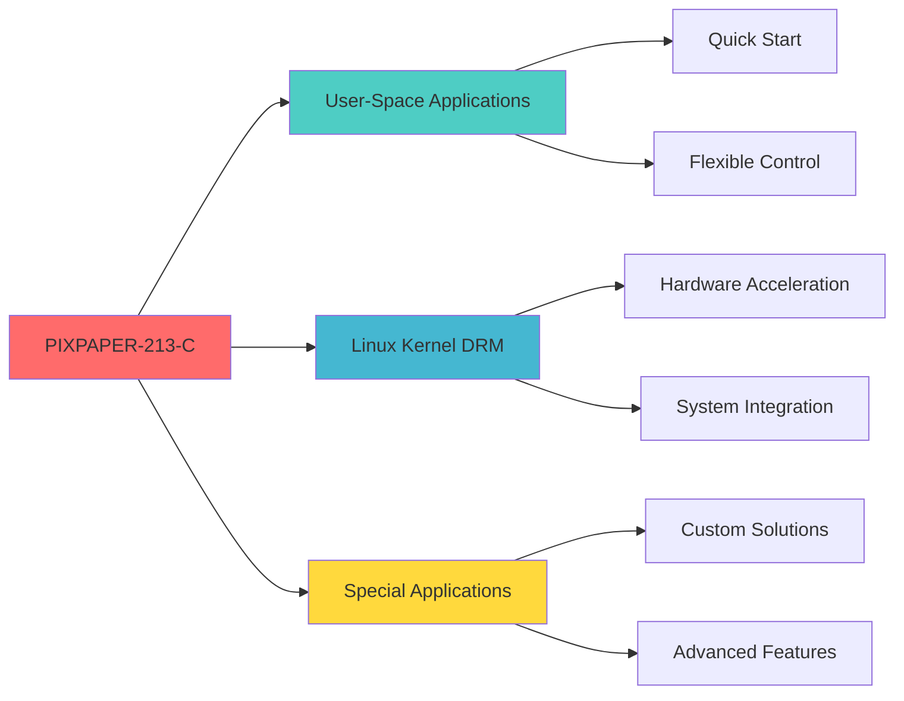

# PIXPAPER-213-C
### 2.13" 4-Color Electronic Paper Display Module

<div align="center">


</div>

---

## 🎯 Product Overview

**Open-EP** introduces **PIXPAPER-213-C** - A professional-grade 2.13 inch 4-color Electronic Paper Display module developed in collaboration with **Triangle Alien Studio**. This prototype showcases exceptional craftsmanship and superior hardware quality, featuring an SPI interface fully compatible with worldwide embedded devices.

<table>
<tr>
<td width="35%">

</td>
<td width="65%">

### 📊 Technical Specifications

| Specification | Details |
|:-------------|:--------|
| **Screen Size** | 2.13 inch |
| **Resolution** | 250 × 122 pixels |
| **Color Support** | Black, White, Yellow, Red |
| **PPI** | 130.6 |
| **Active Area** | 23.7046 × 48.55 mm |
| **Interface** | SPI |
| **Partial Update** | Not Supported |
| **Operating Temp** | 0 - 40°C |

</td>
</tr>
</table>

### 🔌 Pin Configuration
```
3.3V | GND | MOSI | SCK | CS# | DC# | RST# | BUSY
```
> **Note:** DC#, RST#, and BUSY are GPIO-controlled

---

## 📚 Implementation Guide

Choose your implementation approach based on your application requirements:

<div align="center">



</div>

---

## 🚀 User-Space Applications

> **Best for:** Rapid prototyping, application-level control, and cross-platform development

User-space drivers provide direct application control without kernel modifications. Ideal for quick deployment and testing across multiple platforms.

### 🖥️ MPU Platforms (ARM64)

<table>
<tr>
<td align="center" width="25%">

<a href="https://www.renesas.com/" target="_blank">

</a>

#### Renesas
**Status:** ✅ Ready

</td>
<td align="center" width="25%">

<a href="https://www.nxp.com/" target="_blank">

</a>

#### NXP
**Status:** ✅ Ready

</td>
<td align="center" width="25%">

<a href="https://www.telechips.com/" target="_blank">

</a>

#### Telechips
**Status:** ✅ Ready

</td>
<td align="center" width="25%">

<a href="https://www.rockchip.com/" target="_blank">

</a>

#### Rockchip
**Status:** ✅ Ready

</td>
</tr>
</table>

#### 📖 Supported Boards & Guides

| Manufacturer | Board / SoC | Porting Guide | Status |
|:------------|:-----------|:--------------|:------:|
| **Renesas** | KAKIP SBC (RZ/V2H) | [📄 Guide](https://github.com/open-ep/PIXPAPER-213-C/blob/main/KAKIP_PIXPAPAER-213-C.md) | ✅ |
| **NXP** | PANZER-PLUS (IMX8MP) | [📄 Guide](https://github.com/open-ep/PIXPAPER-213-C/blob/main/PANZER-PLUS_PIXPAPAER-213-C.md) | ✅ |
| **NXP** | FRDM-IMX93 (IMX93) | [📄 Guide](https://github.com/open-ep/PIXPAPER-213-C/blob/main/FRDM-IMX93_PIXPAPAER-213-C.md) | ✅ |
| **Telechips** | TOPST D3-G (Dolphin 3M) | [📄 Guide](https://github.com/open-ep/PIXPAPER-213-C/blob/main/D3-G_PIXPAPAER-213-C.md) | ✅ |
| **Rockchip** | CUBE-RK3588 (RK3588) | [📄 Guide](https://github.com/open-ep/PIXPAPER-213-C/blob/main/CUBE-RK3588_PIXPAPAER-213-C.md) | ✅ |

### 🖥️ MPU Platforms (ARM32)

<table>
<tr>
<td align="center">

<a href="https://www.raspberrypi.com/" target="_blank">

</a>

#### Raspberry Pi
**Status:** ✅ Ready

</td>
</tr>
</table>

| Manufacturer | Board | Porting Guide | Status |
|:------------|:------|:--------------|:------:|
| **Raspberry Pi** | Raspberry Pi 2 Model B | [📄 Guide](https://github.com/open-ep/PIXPAPER-213-C/blob/main/RPI2_PIXPAPAER-213-C.md) | ✅ |

### 🔧 MCU Platforms (ARM32)

<table>
<tr>
<td align="center" width="50%">

<a href="https://www.raspberrypi.com/" target="_blank">

</a>

#### Raspberry Pi
**Status:** ✅ Ready

</td>
<td align="center" width="50%">

<a href="https://www.nxp.com/" target="_blank">

</a>

#### NXP
**Status:** ✅ Ready

</td>
</tr>
</table>

| Manufacturer | Board / Core | Porting Guide | Status |
|:------------|:------------|:--------------|:------:|
| **Raspberry Pi** | Raspberry Pi Pico | [📄 Guide](https://github.com/open-ep/PIXPAPER-213-C/blob/main/RPI-PICO_PIXPAPAER-213-C.md) | ✅ |
| **NXP** | FRDM-IMX93 (M33 Core) | [📄 Guide](https://github.com/open-ep/PIXPAPER-213-C/blob/main/FRDM-IMX93-M33_PIXPAPAER-213-C.md) | ✅ |

---

## 🐧 Linux Kernel DRM Integration

> **Best for:** System-level integration, hardware acceleration, and production deployments

DRM (Direct Rendering Manager) integration provides native Linux kernel support for optimal performance and seamless system integration.

### ✨ Advantages

<table>
<tr>
<td width="33%" align="center">

### ⚡ Performance
Hardware-accelerated rendering with zero-copy operations

</td>
<td width="33%" align="center">

### 🔄 Integration
Native support in framebuffer and display subsystems

</td>
<td width="33%" align="center">

### 🛡️ Stability
Kernel-space reliability with proper error handling

</td>
</tr>
</table>

### 📋 Platform Support Status

| Platform | Architecture | DRM Driver Status | Mainline Kernel |
|:---------|:------------|:-----------------|:----------------|
| **i.MX8M Plus** | ARM64 | 🚧 In Development | Planned for v6.8 |
| **RZ/V2H** | ARM64 | 🚧 In Development | Under Review |
| **RK3588** | ARM64 | 📝 Planned | TBD |
| **Raspberry Pi 4** | ARM64 | 📝 Planned | TBD |

> **Note:** DRM drivers are currently under active development. Contact us for early access programs.

### 🔗 Integration Examples

```bash
# Check DRM device
ls -l /dev/dri/

# Display information
modetest -M pixpaper

# Framebuffer access
cat /dev/fb0 > /dev/null
```

---

## 🎨 Special Applications

> **Best for:** Custom solutions, research projects, and advanced use cases

Specialized implementations for unique requirements and cutting-edge applications.

### 🔬 Research & Development

<table>
<tr>
<td width="50%">

#### 🤖 Computer Vision
- Real-time image processing
- Low-power display output
- Edge AI integration

</td>
<td width="50%">

#### 📡 IoT Applications
- Battery-powered displays
- Remote monitoring systems
- Smart home dashboards

</td>
</tr>
<tr>
<td width="50%">

#### 🎓 Educational Projects
- Embedded systems learning
- Display technology research
- SPI protocol education

</td>
<td width="50%">

#### 🏭 Industrial Applications
- Process monitoring
- Equipment status displays
- Factory automation

</td>
</tr>
</table>

### 🛠️ Custom Development Services

We offer tailored solutions for your specific needs:

- ✅ Custom driver development
- ✅ Platform porting services
- ✅ Performance optimization
- ✅ Technical consulting
- ✅ Batch customization

### 📞 Contact for Special Projects

Have a unique application in mind? We'd love to collaborate!

---

## 🤝 Community & Support

<div align="center">

### Stay Connected

[](https://github.com/open-ep/PIXPAPER-213-C/issues)
[](https://github.com/open-ep/PIXPAPER-213-C/discussions)
[](https://github.com/open-ep/PIXPAPER-213-C/wiki)

</div>

### 📬 Get Help

- **Technical Issues:** [Open an Issue](https://github.com/open-ep/PIXPAPER-213-C/issues)
- **Feature Requests:** [Start a Discussion](https://github.com/open-ep/PIXPAPER-213-C/discussions)
- **Commercial Inquiries:** contact@open-ep.io

---

## 📄 License & Credits

**PIXPAPER-213-C** is developed by **Open-EP** in collaboration with **Triangle Alien Studio**.

<div align="center">

Made with ❤️ for the Embedded Community

**[Documentation](https://github.com/open-ep/PIXPAPER-213-C/wiki)** • **[Examples](https://github.com/open-ep/PIXPAPER-213-C/tree/main/examples)** • **[Changelog](https://github.com/open-ep/PIXPAPER-213-C/blob/main/CHANGELOG.md)**

</div>
